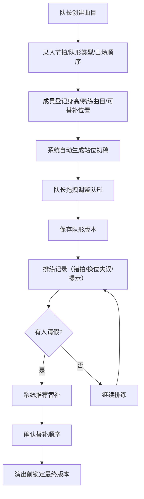

## 1. 产品概述

社区广场舞队形编排与替补站位协同系统，面向社区中老年广场舞队伍，解决口头记队形导致的混乱问题。系统支持曲目管理、智能站位生成、拖拽编排、替补调整和排练统计，让队形管理从"靠脑子记"升级为"数字化协同"。

- 目标用户：社区广场舞队长、队员、舞蹈老师
- 核心价值：减少排练混乱，提升替补协作效率，量化排练数据

## 2. 核心功能

### 2.1 用户角色

| 角色 | 注册方式 | 核心权限 |
|------|----------|----------|
| 队长 | 系统预设 | 管理曲目、编排队形、确认演出版本、查看统计 |
| 队员 | 登记入场 | 查看站位、登记个人信息、查看排练记录 |
| 老师 | 系统预设 | 记录错拍/换位失误、添加排练提示 |

### 2.2 功能模块

1. **曲目档案页**：曲目列表、新增/编辑曲目（节拍长度、队形类型、出场顺序）、曲目详情
2. **队形编排页**：自动生成站位初稿、拖拽调整队形、保存队形版本、预览队形切换
3. **成员站位页**：成员登记（身高区间、熟练曲目、可替补位置）、按曲目查看成员站位
4. **替补调整页**：请假标记、替补自动推荐、替补顺序确认、演出前最终版本锁定
5. **统计页**：排练次数、替补发生率、高频错位位置热力图、成员出勤活跃度

### 2.3 页面详情

| 页面名称 | 模块名称 | 功能描述 |
|----------|----------|----------|
| 曲目档案 | 曲目列表 | 展示所有曲目卡片，含曲名、节拍数、队形类型、出场顺序标签 |
| 曲目档案 | 新增/编辑曲目 | 表单录入曲名、节拍长度、队形类型（一字/三角/方块/圆形/双排/V字）、出场顺序 |
| 队形编排 | 队形画布 | 根据曲目和成员自动生成站位初稿，支持拖拽调整位置 |
| 队形编排 | 版本管理 | 保存队形版本快照，可回溯历史版本 |
| 队形编排 | 队形切换预览 | 按出场顺序切换不同曲目的队形 |
| 成员站位 | 成员列表 | 展示所有成员信息卡片，含姓名、身高区间、熟练曲目、可替补位置 |
| 成员站位 | 成员登记/编辑 | 表单录入姓名、身高区间、熟练曲目（多选）、可替补位置（多选） |
| 成员站位 | 站位视图 | 按曲目查看成员在队形中的站位分布 |
| 替补调整 | 出勤状态 | 标记成员请假/到场，实时更新站位图 |
| 替补调整 | 替补推荐 | 根据熟练曲目和可替补位置自动推荐替补人选 |
| 替补调整 | 替补顺序 | 确认替补优先级顺序 |
| 替补调整 | 版本锁定 | 演出前锁定最终站位版本，不可再修改 |
| 统计 | 排练统计 | 各曲目排练次数柱状图 |
| 统计 | 替补统计 | 替补发生率、各位置替补频次 |
| 统计 | 错位热力图 | 高频错位位置可视化 |
| 统计 | 出勤活跃度 | 成员出勤率排行、活跃度趋势 |

## 3. 核心流程

**队形编排流程**：队长创建曲目 → 录入节拍和队形类型 → 成员登记信息 → 系统自动生成站位初稿 → 队长拖拽调整 → 保存队形版本

**排练记录流程**：选择曲目 → 排练 → 记录错拍片段/换位失误/老师提示 → 保存排练记录

**替补调整流程**：成员请假 → 系统推荐替补 → 确认替补顺序 → 演出前锁定最终版本

## 4. 用户界面设计

### 4.1 设计风格

- 主色调：暖红色（#E53935）象征广场舞的热情活力，辅以金色（#FFB300）点缀
- 次要色调：深灰（#1F2937）文字，浅灰白（#F9FAFB）背景
- 按钮风格：圆角按钮，主按钮填充暖红色，次要按钮描边
- 字体：标题使用 Noto Serif SC（端庄大方），正文使用 Noto Sans SC（清晰易读），字号偏大适配中老年用户
- 布局风格：左侧导航栏 + 右侧内容区，卡片式布局
- 图标风格：Lucide 图标库，线性风格

### 4.2 页面设计概览

| 页面名称 | 模块名称 | UI元素 |
|----------|----------|--------|
| 曲目档案 | 曲目列表 | 卡片网格，每张卡片含曲名、节拍标签、队形类型图标、出场序号徽章 |
| 曲目档案 | 新增/编辑弹窗 | 居中弹窗表单，队形类型用图标选择器 |
| 队形编排 | 队形画布 | 大面积画布区域，成员用圆形头像卡片表示，可拖拽移动，网格参考线 |
| 队形编排 | 版本时间线 | 底部横向时间线，点击切换历史版本 |
| 成员站位 | 成员列表 | 左侧成员卡片列表，右侧站位预览 |
| 成员站位 | 成员登记弹窗 | 表单含身高滑块、曲目多选标签、位置多选 |
| 替补调整 | 出勤面板 | 成员状态切换（到场/请假），请假成员灰显 |
| 替补调整 | 替补推荐卡片 | 推荐人选卡片，含匹配度百分比，可拖拽到站位图 |
| 统计 | 排练柱状图 | 彩色柱状图，悬停显示详情 |
| 统计 | 错位热力图 | 队形网格热力图，红色深浅表示错位频率 |
| 统计 | 出勤排行 | 环形进度条 + 排行列表 |

### 4.3 响应式设计

- 桌面优先设计，主要在平板和电脑上使用
- 队形画布区域最小宽度 800px
- 字号整体偏大（最小 14px），适配中老年用户视力需求
- 按钮和交互区域最小 44px 点击热区

### 4.4 无3D场景
