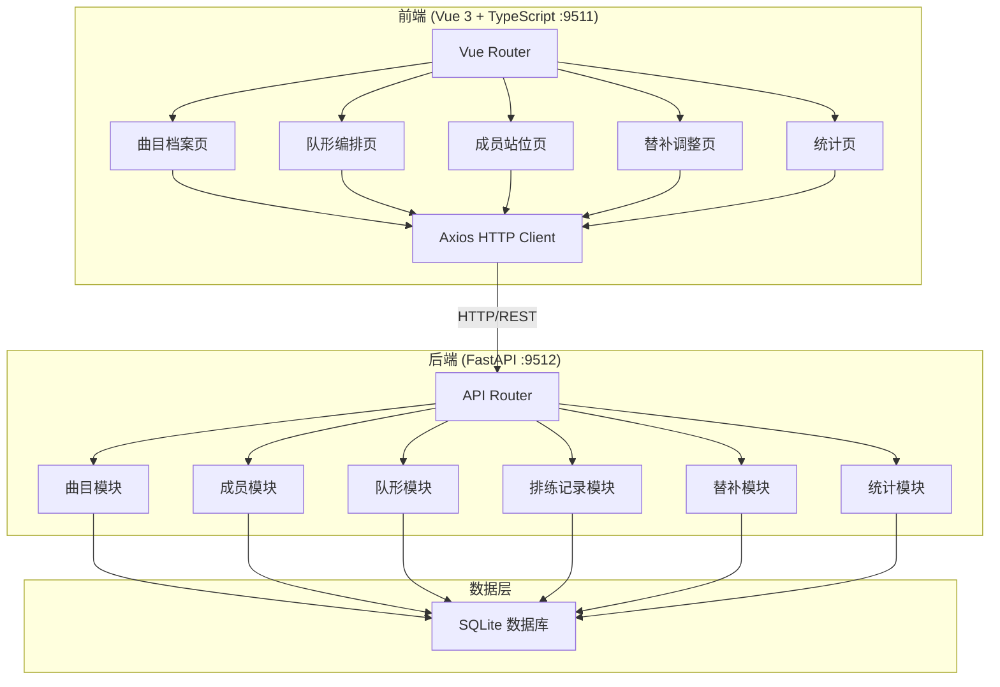
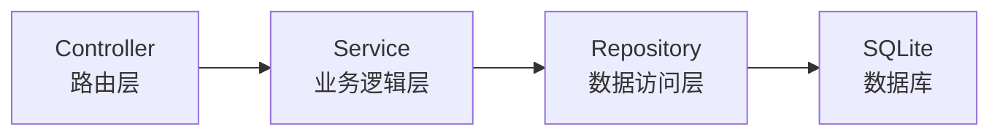
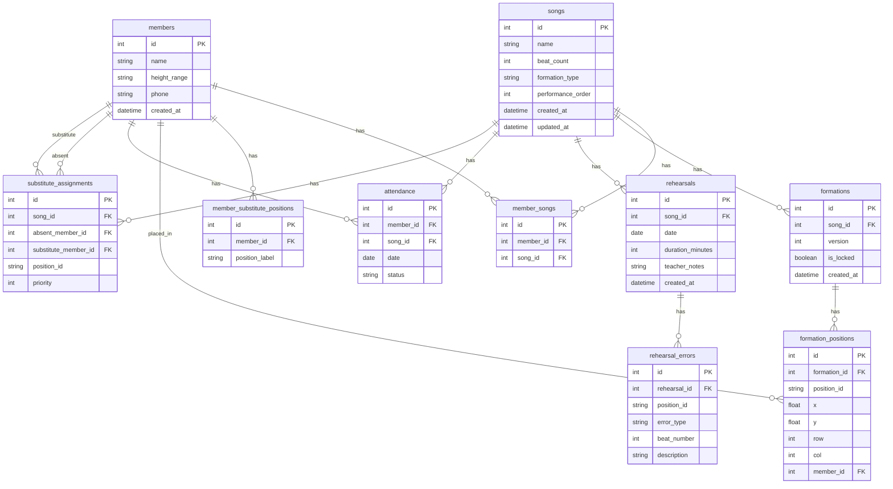

## 1. 架构设计



## 2. 技术说明

- 前端：Vue 3 + TypeScript + Vite + Tailwind CSS + Vue Router + Pinia
- 初始化工具：vite-init (vue-ts template)
- 后端：FastAPI + Uvicorn + SQLAlchemy + Pydantic
- 数据库：SQLite（轻量级，适合社区小团队场景）
- 拖拽库：vuedraggable（队形编排拖拽）
- 图表库：Chart.js + vue-chartjs（统计图表）

## 3. 路由定义

| 路由 | 用途 |
|------|------|
| / | 首页/曲目档案 |
| /songs | 曲目档案列表 |
| /formation | 队形编排（选择曲目后进入画布） |
| /members | 成员站位管理 |
| /substitute | 替补调整 |
| /statistics | 统计页 |

## 4. API 定义

### 4.1 曲目模块

```typescript
interface Song {
  id: number
  name: string
  beat_count: number
  formation_type: "line" | "triangle" | "square" | "circle" | "double_row" | "v_shape"
  performance_order: number
  created_at: string
  updated_at: string
}

// POST /api/songs - 创建曲目
// GET /api/songs - 获取曲目列表
// GET /api/songs/{id} - 获取曲目详情
// PUT /api/songs/{id} - 更新曲目
// DELETE /api/songs/{id} - 删除曲目
```

### 4.2 成员模块

```typescript
interface Member {
  id: number
  name: string
  height_range: "short" | "medium" | "tall"
  skilled_songs: number[]
  substitute_positions: string[]
  phone: string
  created_at: string
}

// POST /api/members - 创建成员
// GET /api/members - 获取成员列表
// GET /api/members/{id} - 获取成员详情
// PUT /api/members/{id} - 更新成员
// DELETE /api/members/{id} - 删除成员
```

### 4.3 队形模块

```typescript
interface FormationPosition {
  position_id: string
  x: number
  y: number
  member_id: number | null
  row: number
  col: number
}

interface Formation {
  id: number
  song_id: number
  version: number
  positions: FormationPosition[]
  is_locked: boolean
  created_at: string
}

// POST /api/formations/generate/{song_id} - 自动生成站位初稿
// GET /api/formations/{song_id} - 获取当前队形
// GET /api/formations/{song_id}/versions - 获取队形版本列表
// PUT /api/formations/{id} - 更新队形（拖拽后保存）
// POST /api/formations/{id}/lock - 锁定队形版本
```

### 4.4 排练记录模块

```typescript
interface RehearsalRecord {
  id: number
  song_id: number
  date: string
  beat_errors: BeatError[]
  position_errors: PositionError[]
  teacher_notes: string
  duration_minutes: number
}

interface BeatError {
  position_id: string
  beat_number: number
  description: string
}

interface PositionError {
  position_id: string
  description: string
}

// POST /api/rehearsals - 创建排练记录
// GET /api/rehearsals?song_id={id} - 获取曲目排练记录
// GET /api/rehearsals/{id} - 获取排练详情
```

### 4.5 替补模块

```typescript
interface SubstituteAssignment {
  id: number
  song_id: number
  absent_member_id: number
  substitute_member_id: number
  position_id: string
  priority: number
}

interface AttendanceRecord {
  member_id: number
  song_id: number
  status: "present" | "absent"
  date: string
}

// POST /api/substitutes/attendance - 标记出勤
// GET /api/substitutes/recommend?song_id={id}&absent_member_id={id} - 推荐替补
// POST /api/substitutes/assign - 分配替补
// GET /api/substitutes/{song_id} - 获取曲目替补安排
// PUT /api/substitutes/{id}/priority - 调整替补优先级
```

### 4.6 统计模块

```typescript
interface Statistics {
  rehearsal_counts: { song_id: number; song_name: string; count: number }[]
  substitute_rates: { song_id: number; song_name: string; rate: number }[]
  error_positions: { position_id: string; count: number }[]
  attendance: { member_id: number; member_name: string; rate: number; trend: number[] }[]
}

// GET /api/statistics/overview - 获取统计概览
// GET /api/statistics/rehearsal-counts - 排练次数统计
// GET /api/statistics/substitute-rates - 替补发生率统计
// GET /api/statistics/error-positions - 高频错位位置
// GET /api/statistics/attendance - 成员出勤活跃度
```

## 5. 服务架构图



## 6. 数据模型

### 6.1 数据模型定义



### 6.2 数据定义语言

```sql
CREATE TABLE songs (
    id INTEGER PRIMARY KEY AUTOINCREMENT,
    name VARCHAR(100) NOT NULL,
    beat_count INTEGER NOT NULL,
    formation_type VARCHAR(20) NOT NULL CHECK (formation_type IN ('line', 'triangle', 'square', 'circle', 'double_row', 'v_shape')),
    performance_order INTEGER NOT NULL DEFAULT 0,
    created_at DATETIME DEFAULT CURRENT_TIMESTAMP,
    updated_at DATETIME DEFAULT CURRENT_TIMESTAMP
);

CREATE TABLE members (
    id INTEGER PRIMARY KEY AUTOINCREMENT,
    name VARCHAR(50) NOT NULL,
    height_range VARCHAR(10) NOT NULL CHECK (height_range IN ('short', 'medium', 'tall')),
    phone VARCHAR(20),
    created_at DATETIME DEFAULT CURRENT_TIMESTAMP
);

CREATE TABLE member_songs (
    id INTEGER PRIMARY KEY AUTOINCREMENT,
    member_id INTEGER NOT NULL REFERENCES members(id) ON DELETE CASCADE,
    song_id INTEGER NOT NULL REFERENCES songs(id) ON DELETE CASCADE,
    UNIQUE(member_id, song_id)
);

CREATE TABLE member_substitute_positions (
    id INTEGER PRIMARY KEY AUTOINCREMENT,
    member_id INTEGER NOT NULL REFERENCES members(id) ON DELETE CASCADE,
    position_label VARCHAR(20) NOT NULL
);

CREATE TABLE formations (
    id INTEGER PRIMARY KEY AUTOINCREMENT,
    song_id INTEGER NOT NULL REFERENCES songs(id) ON DELETE CASCADE,
    version INTEGER NOT NULL DEFAULT 1,
    is_locked BOOLEAN NOT NULL DEFAULT 0,
    created_at DATETIME DEFAULT CURRENT_TIMESTAMP
);

CREATE TABLE formation_positions (
    id INTEGER PRIMARY KEY AUTOINCREMENT,
    formation_id INTEGER NOT NULL REFERENCES formations(id) ON DELETE CASCADE,
    position_id VARCHAR(20) NOT NULL,
    x REAL NOT NULL,
    y REAL NOT NULL,
    row_num INTEGER NOT NULL,
    col_num INTEGER NOT NULL,
    member_id INTEGER REFERENCES members(id) ON DELETE SET NULL
);

CREATE TABLE rehearsals (
    id INTEGER PRIMARY KEY AUTOINCREMENT,
    song_id INTEGER NOT NULL REFERENCES songs(id) ON DELETE CASCADE,
    date DATE NOT NULL,
    duration_minutes INTEGER NOT NULL DEFAULT 60,
    teacher_notes TEXT,
    created_at DATETIME DEFAULT CURRENT_TIMESTAMP
);

CREATE TABLE rehearsal_errors (
    id INTEGER PRIMARY KEY AUTOINCREMENT,
    rehearsal_id INTEGER NOT NULL REFERENCES rehearsals(id) ON DELETE CASCADE,
    position_id VARCHAR(20) NOT NULL,
    error_type VARCHAR(20) NOT NULL CHECK (error_type IN ('beat_error', 'position_error')),
    beat_number INTEGER,
    description TEXT
);

CREATE TABLE attendance (
    id INTEGER PRIMARY KEY AUTOINCREMENT,
    member_id INTEGER NOT NULL REFERENCES members(id) ON DELETE CASCADE,
    song_id INTEGER NOT NULL REFERENCES songs(id) ON DELETE CASCADE,
    date DATE NOT NULL,
    status VARCHAR(10) NOT NULL CHECK (status IN ('present', 'absent')),
    UNIQUE(member_id, song_id, date)
);

CREATE TABLE substitute_assignments (
    id INTEGER PRIMARY KEY AUTOINCREMENT,
    song_id INTEGER NOT NULL REFERENCES songs(id) ON DELETE CASCADE,
    absent_member_id INTEGER NOT NULL REFERENCES members(id) ON DELETE CASCADE,
    substitute_member_id INTEGER NOT NULL REFERENCES members(id) ON DELETE CASCADE,
    position_id VARCHAR(20) NOT NULL,
    priority INTEGER NOT NULL DEFAULT 1
);

CREATE INDEX idx_songs_performance_order ON songs(performance_order);
CREATE INDEX idx_formations_song_id ON formations(song_id);
CREATE INDEX idx_formation_positions_formation_id ON formation_positions(formation_id);
CREATE INDEX idx_rehearsals_song_id ON rehearsals(song_id);
CREATE INDEX idx_rehearsal_errors_rehearsal_id ON rehearsal_errors(rehearsal_id);
CREATE INDEX idx_attendance_member_date ON attendance(member_id, date);
CREATE INDEX idx_substitute_assignments_song ON substitute_assignments(song_id);
```
